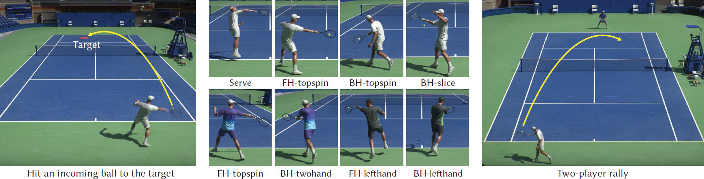

# Learning Physically Simulated Tennis Skills from Broadcast Videos

<strong>Haotian zhang</strong>, Ye Yuan, Viktor Makoviychuk, Yunrong Guo, Sanja Fidler, Xue Bin Peng, Kayvon Fatahalian

SIGGRAPH 2023 (best paper honorable mention) 

[Paper](https://research.nvidia.com/labs/toronto-ai/vid2player3d/data/tennis_skills_main.pdf) |
[Project](https://research.nvidia.com/labs/toronto-ai/vid2player3d/) |
[Video](https://youtu.be/ZZVKrNs7_mk) 



### Note: the current release provides the implementation of the hierarchical controller, including the low-level imitation policy, motion embedding and the high-level planning policy, as well as the environment setup in IsaacGym. Unfortunately, the demo can NOT run because the trained models are currently not available due to license issues. 

# Environment setup

### 1. Download IsaacGym and create python virtual env
You can download IsaacGym Preview Release 4 from the official [site](https://developer.nvidia.com/isaac-gym).
Then download Miniconda3 from [here](https://repo.anaconda.com/miniconda/Miniconda3-py37_23.1.0-1-Linux-x86_64.sh).
Create a conda virtual env named `rlgpu` by running `create_conda_env_rlgpu.sh` from IsaacGym, either python3.7 or python3.8 works.
Note you might need to run the following command or add it to your `.bashrc` if you encounter the error `ImportError: libpython3.7m.so.1.0: cannot open shared object file: No such file or directory` when running IsaacGym.
```
export LD_LIBRARY_PATH=<YOUR CONDA PATH>envs/rlgpu/lib/
``` 

### 2. Install dependencies 
Enter the created virtual env and run the install script.
```
conda activate rlgpu
bash install.sh
```

### 3. Install [smpl_visualizer](https://github.com/Haotianz94/smpl_visualizer) for visualizing results
Git clone and then run 
```
bash install.sh
```

### 4. Download data/checkpoints

Download [data](https://drive.google.com/drive/folders/1kkM9tl1T3dXZbvh5oYHSerL0JkgaL1Mi?usp=sharing) into `vid2player3d/data`.

Download checkpoints of motion VAE and trained polices into `vid2player3d/results` (currently unavailable).

Download SMPL [models](https://download.is.tue.mpg.de/download.php?domain=smpl&sfile=SMPL_python_v.1.0.0.zip) (male and female models) into `smpl_visualizer/data/smpl` after registering and rename the files as `SMPL_MALE.pkl` and `SMPL_FEMALE.pkl`.

# Testing with trained models
### Single player
In the single player setting, the player will react to consecutive incoming tennis balls from the other side.
The script below runs the simulation and renders the result online. The simulation will be reset after 300 frames. You can change the player by chaning`--cfg` to `djokovic` or `nadal`. 
```
python vid2player/run.py --cfg federer --rl_device cuda:0 --test --num_envs 1 --episode_length 300 --seed 0 --checkpoint latest --enable_shadow
```

The script below will run the simulations in batch and render the result videos offline and saved into `out/video`. You can also change `--record` to `--record_scenepic`, which will save the result into an interactive html file under `out/html`. Note that the saved html file is large and may take seconds to load.
```
python vid2player/run.py --cfg federer --rl_device cuda:0 --test --num_envs 8192 --episode_length 300 --seed 0 --checkpoint latest --select_best --enable_shadow --num_rec_frames 300 --num_eg 5 --record --headless
```

### Dual player
In the dual player setting, the two players will play tennis rally against each other.
The script below runs the simulation and renders the result online. The simulation will be reset if the ball is missed or out. You can change the players by changing `--cfg` to `nadal_djokovic`. More player settings will be added soon. 
```
python vid2player/run.py --cfg federer_djokovic --rl_device cuda:0 --test --num_envs 2 --episode_length 10000 --seed 0 --checkpoint latest --enable_shadow
```

The script below will run the simulations in batch and render the result videos offline and saved into `out/video`.
```
python vid2player/run.py --cfg federer_djokovic --rl_device cuda:0 --test --num_envs 8192 --episode_length 10000 --seed 0 --checkpoint latest --enable_shadow --headless --num_rec_frames 600 --num_eg 5 --record
```

# Training with your motion

### Low-level policy
We did not release the full training code for the low-level imitation policy, but [tennis_im.yaml](vid2player/cfg/im/tennis_im.yaml) and [humanoid_smpl_im_mvae.py](vid2player/env/tasks/humanoid_smpl_im_mvae.py) basically implement the environment except for the data loading and the overall training loop can be designed similar to that of the high-level policy, which is provided under [vid2player](vid2player).
### Motion VAE
We provide code for training the motion VAE. Please organize your motion data following the format described in [Video3DPoseDataset](vid2player/motion_vae/dataset.py).
### High-level policy
We also provide code for training the high-level policy. As described in the paper, we design a curriculum trained in three stages. You can run the following script to execute the curriculum training (assuming the checkpoints for the low-leve policy and motion VAE are available).
```
python vid2player/run.py --cfg federer_train_stage_1 --rl_device cuda:0 --headless
python vid2player/run.py --cfg federer_train_stage_2 --rl_device cuda:0 --headless
python vid2player/run.py --cfg federer_train_stage_3 --rl_device cuda:0 --headless
```


# Citation
```
@article{
  zhang2023vid2player3d,
  author = {Zhang, Haotian and Yuan, Ye and Makoviychuk, Viktor and Guo, Yunrong and Fidler, Sanja and Peng, Xue Bin and Fatahalian, Kayvon},
  title = {Learning Physically Simulated Tennis Skills from Broadcast Videos},
  journal = {ACM Trans. Graph.},
  issue_date = {August 2023},
  numpages = {14},
  doi = {10.1145/3592408},
  publisher = {ACM},
  address = {New York, NY, USA},
  keywords = {physics-based character animation, imitation learning, reinforcement learning},
}
```

# References
This repository is built on top of the following repositories:
* Low-level imitation policy is adapted from [EmbodiedPose](https://github.com/ZhengyiLuo/EmbodiedPose)
* Motion VAE is adapted from [character-motion-vaes](https://github.com/electronicarts/character-motion-vaes) 


# Contact
For any question regarding this project, please contact Haotian Zhang via haotianz@nvidia.com.
